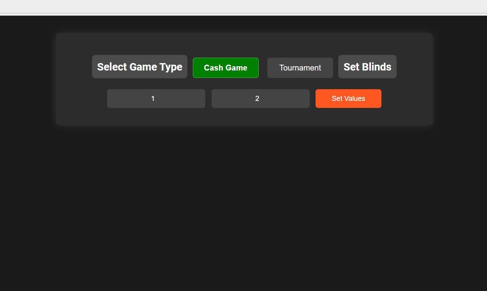
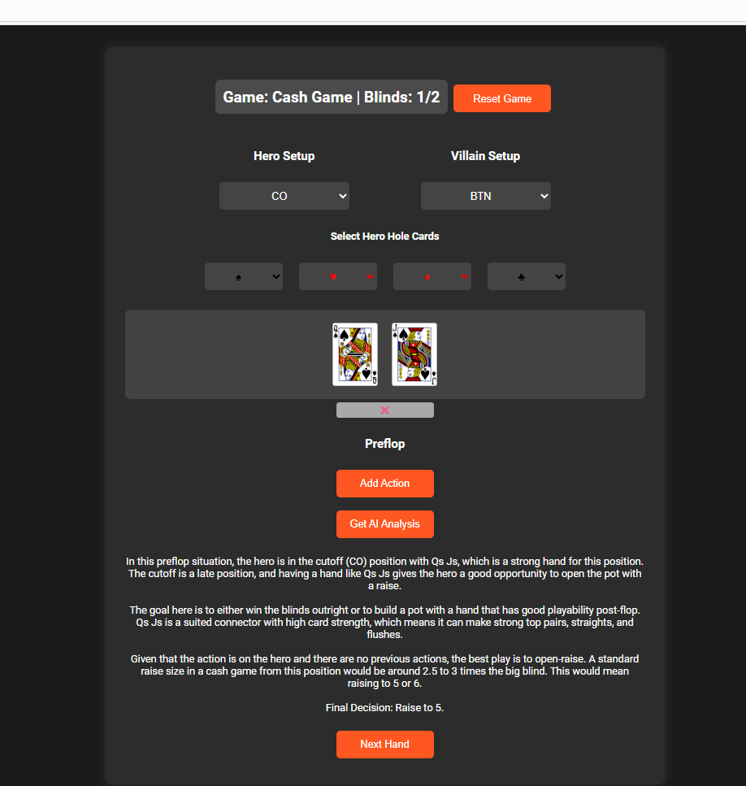
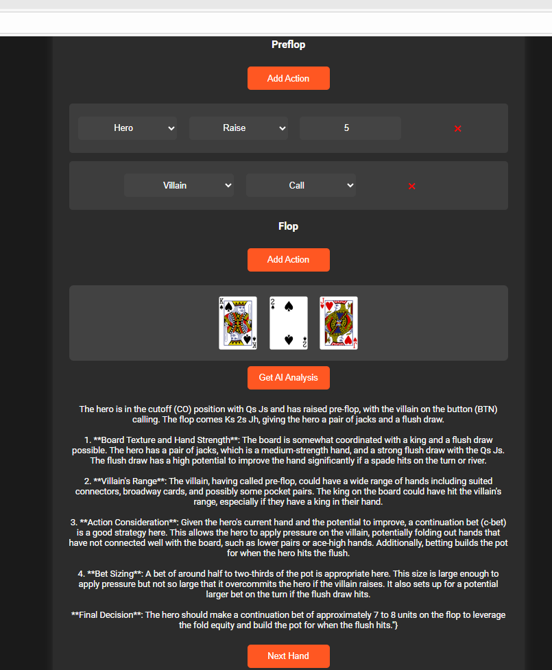

# GTO Poker Agent (LLM Coach + Hand Evaluator Web App)

**Primary Focus:** LLM-based decision-support agent  
**Secondary Capabilities:** Poker hand evaluation, simulation, Flask web app, structured AI outputs  
**Domains:** Game AI, decision-making systems, human-in-the-loop analysis  

**Role:** Sole builder (end-to-end)  
**Stack:** Python, Flask, OpenAI API, Treys, Pydantic, HTML/CSS/JS

---

## Executive Summary

Built a web-based Texas Hold’em decision-support agent that combines deterministic poker hand evaluation with an LLM-powered “poker coach.” The system allows users to incrementally construct a hand (positions, blinds, cards, actions by street), computes current hand strength and draw outcomes, and then uses an LLM to analyze the full game state and explain optimal or near-GTO decisions in natural language.

---

## Motivation / Why I Built This

The goal was to explore how LLMs can act as **reasoning layers on top of deterministic tools**, rather than replacing them. Poker is a constrained, rules-heavy domain that makes it ideal for testing:
- structured state representation
- tool-assisted reasoning
- explainable recommendations instead of black-box outputs

I also wanted a simple web-based interface so the system felt interactive rather than purely analytical.

---

## Core Capabilities

### 1) Deterministic Hand Evaluation
- Uses a poker hand evaluation library to score hero cards against the current board.
- Converts raw evaluator outputs into:
  - human-readable hand classes (e.g., Pair, Two Pair)
  - percentile-style strength estimates relative to all possible hands

This provides an objective baseline that the LLM can reason over.

---

### 2) Draw and Outcome Analysis
For flop and turn states:
- Removes known cards (hero + board) from a full deck
- Iterates through all remaining possible next cards
- Evaluates resulting hands and aggregates outcomes by hand class

The result is a concise summary of:
- which hands can be hit
- how often they occur
- the average strength of those outcomes

This mirrors the type of equity intuition human players develop, but in a computable form.

---

### 3) LLM-Based Poker Coach / Agent
The system constructs a structured game-state payload that includes:
- hero hand and board (normalized)
- positions and blinds
- full betting/action history by street
- current hand strength and draw summaries (when applicable)

An LLM is then prompted to:
- analyze the state as an expert or GTO-style opponent
- reason about the situation using the provided quantitative context
- produce a recommended strategy and a clear explanation for the decision

The focus is on **interpretability and teaching**, not just raw action selection.

---

## Agent Interaction Flow

1. User inputs game parameters and actions via the UI
2. Backend updates a centralized game-state object
3. Deterministic tools compute hand strength and potential improvements
4. The enriched game state is passed to the LLM
5. The agent returns a structured recommendation and explanation
6. The UI displays the explanation to the user

This creates a tight loop between tools, reasoning, and presentation.

---

## Game State Representation

The entire hand is represented as a single structured object containing:
- game configuration (type, blinds)
- hero and villain positions
- hero hole cards
- board cards by street
- ordered action history by street

This design makes the system:
- easy to serialize
- easy to debug
- easy to extend with additional signals (stack depth, pot size, ranges)

---

## Prompting & Reasoning Strategy

Two conceptual prompting modes were explored:
- **GTO-style framing:** assumes an optimal, tendency-free opponent
- **Coach-style framing:** emphasizes explanation and decision rationale

The deployed flow prioritizes the coaching perspective to maximize clarity and learning value, while still grounding recommendations in quantitative context.

---

## Why This Counts as an Agent Project

This project demonstrates a general agent pattern that extends well beyond poker:

- deterministic tools generate reliable, domain-specific signals
- a structured state object captures the full context
- an LLM reasons over that state and produces an interpretable recommendation
- a UI turns the agent into an interactive system

This same architecture applies to many real-world decision-support agents (finance, operations, scheduling, diagnostics).

---

## Limitations & Future Extensions

- Surface full mixed-strategy probabilities in the UI
- Incorporate stack depth, pot odds, and bet sizing
- Add opponent range assumptions or user-defined ranges
- Add evaluation against solver outputs for benchmarking
- Persist hand histories for replay and analysis

---

## Artifacts

- Backend: Flask API with deterministic evaluation + LLM reasoning
- Evaluation: Hand strength scoring and next-card outcome simulation
- Frontend: Interactive HTML/JS/CSS hand builder

## Application Interface

### Initial Hand Setup

### Pre-Flop Analysis

### Post-Flop Analysis

