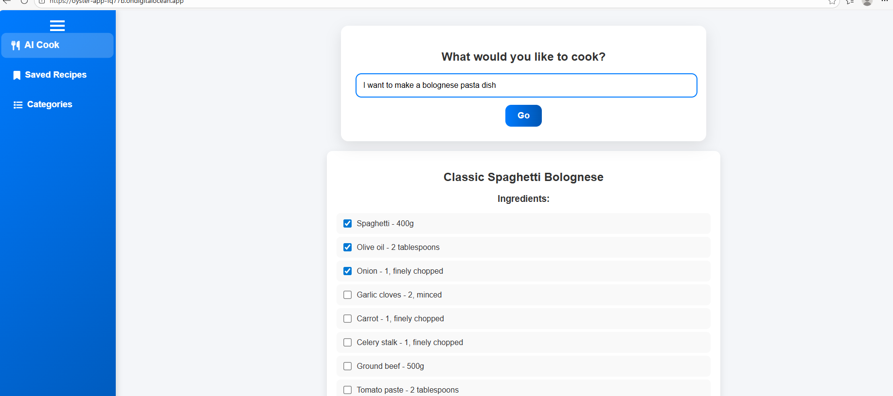
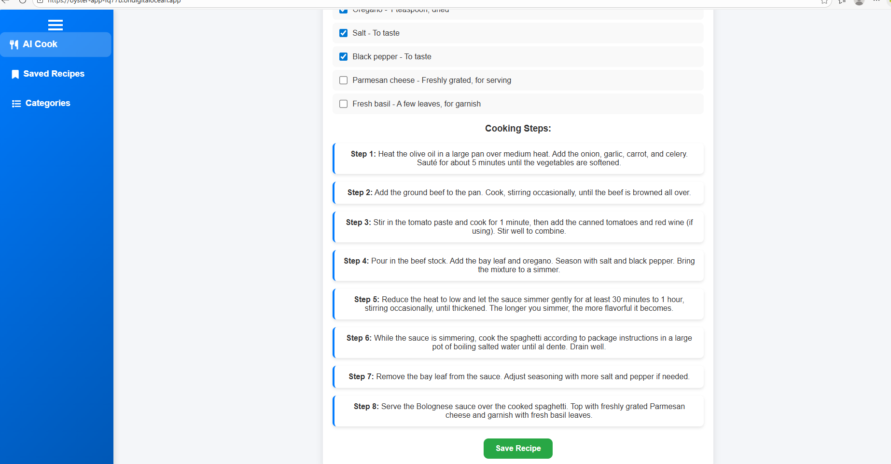
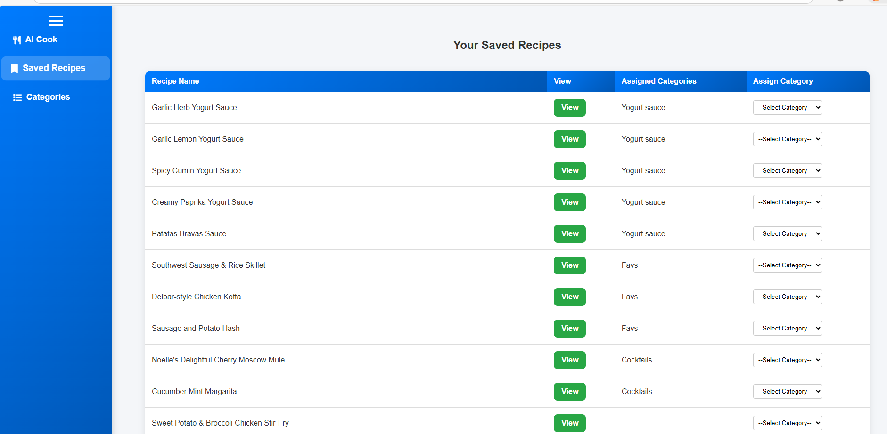

# Recipe Agent (Personal Recipe Builder + Saved Cookbook)

**Status:** Deployed (DigitalOcean)  
**Primary Focus:** LLM-based content generation + personal “agentic” app  
**Secondary Capabilities:** Full-stack Flask app, auth, Postgres, CRUD, categorization, deployment  
**Domains:** Consumer productivity, personal knowledge management, food/recipes  

**Role:** Sole builder (end-to-end)  
**Stack:** Python, Flask, Flask-Login, Postgres (DigitalOcean), psycopg2, OpenAI API, Pydantic, HTML/CSS/JS

---

## Executive Summary

Built a personal “recipe agent” web application that generates recipes on demand using an LLM and lets users save, organize, and revisit them later. The app supports account creation and login, stores recipes in a hosted Postgres database, and provides a UI optimized for cooking and grocery workflows: recipes are easy to browse, ingredients and steps are clearly displayed, and ingredients can be checked off like a shopping list. Users can also create custom categories (e.g., “Favorite Dinners”, “Cocktails”) and assign recipes to categories for quick retrieval.

---

## Motivation / Why I Built This

I wanted a single place to:
- generate new recipes I’d actually cook (based on a craving or constraint)
- save the good ones long-term
- quickly view ingredients and steps while cooking
- use the ingredient list like a “grocery checklist”
- organize recipes in personal categories without relying on external apps

This project was also a practical test of building an LLM-powered product end-to-end:
LLM output → structured data → persisted records → usable UI.

---

## Core Capabilities

### 1) LLM Recipe Generation (Structured Output)
- User submits a free-text request (dish idea, constraints, style, etc.).
- LLM returns a structured recipe object:
  - recipe name
  - ingredients list (ingredient + amount)
  - step-by-step cooking instructions

Structured output makes the result immediately usable by the UI and database.

---

### 2) Accounts + Authentication
- User registration and login backed by Postgres.
- Passwords are hashed (not stored in plaintext).
- Route protection ensures users only access their own recipes and categories.

---

### 3) Saved Recipe Library (User-Scoped CRUD)
Logged-in users can:
- save generated recipes
- browse a list of saved recipes
- view recipe details (ingredients + steps)
- delete recipes

All operations are scoped by `user_id`.

---

### 4) Categories + Organization
Users can:
- create custom categories (any names they want)
- assign recipes to one or more categories (many-to-many)

This supports organizing recipes into collections like “Favorite Dinners”, “Cocktails”, etc.

---

### 5) Cooking/Grocery-Friendly UI
The UI is built around the real “cook + shop” workflow:
- quick recipe selection and viewing
- clear ingredients + steps
- ingredients can be checked off like a grocery list

---

## System Overview

1. User logs in
2. User requests a recipe (free-text prompt)
3. LLM returns structured recipe data (name, ingredients, steps)
4. User saves recipe → persisted in Postgres and tied to their account
5. User browses saved recipes (optionally by category)
6. User opens a recipe and uses it while shopping/cooking

---

## Data Model (Postgres)

- `recipe_users(user_id, email, password_hash)`
- `recipes(id, recipe_name, ingredients_list, cooking_steps, user_id)`
- `categories(id, category_name, user_id)`
- `recipe_categories(recipe_id, category_id)` (many-to-many)

This enables:
- strict user scoping
- flexible user-defined categories
- safe deletion via cascading relationships

---

## Deployment

- Deployed on DigitalOcean
- Connects to a hosted Postgres database on DigitalOcean
- Uses environment variables for secrets and database configuration

---

## Limitations & Future Extensions

- Manual editing of recipes after generation
- Search across ingredients / recipes
- Grocery list aggregation across multiple recipes
- Sharing (public/private links per recipe)
- Media support (images, servings scaling, timers)

---

## Artifacts

- Backend: Flask app with auth, CRUD, categories, and LLM recipe generation
- Database: Postgres schema with user scoping + many-to-many categories
- Frontend: HTML templates + JS + CSS optimized for cooking workflows

---

## Application Interface

### Recipe Generation (Part 1)

### Recipe Generation (Part 2)

### Saved Recipes View

